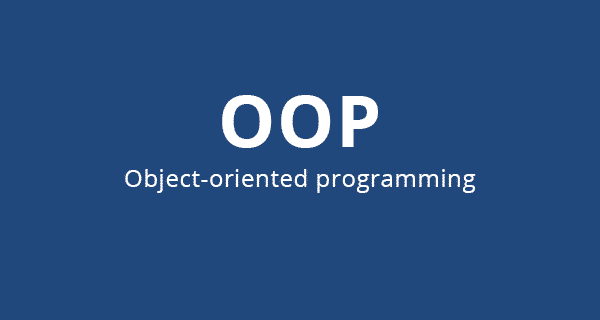

Java-Grammar
==========

> 😸 : 자바를 공부하면서 문법을 간략히 정리해 놓으면 좋을 것 같아서 
시작하게된 자바 정리 레포지토리입니다.  
  
## Java란?  
> 😸 : 자바 개요와 JVM, 철학, 사용하는 곳 등을 정리해 놓았습니다.
  
[자바란?](https://github.com/huewilliams/learning-Java/blob/master/what%20is%20Java.md)
## 기초 문법
  
### 입문
* [변수](https://github.com/huewilliams/learning-Java/blob/master/basic/variable/ReadMe.md)
* [상수](https://github.com/huewilliams/learning-Java/tree/master/basic/constant)
* [주석](https://github.com/huewilliams/learning-Java/blob/master/basic/comment/ReadMe.md)
* main 메소드
* [키보드 입력](https://github.com/huewilliams/learning-Java/blob/master/basic/keyboardInput/KeyInput.md)
    * [예제](https://github.com/huewilliams/learning-Java/blob/master/basic/keyboardInput/Input.java)

### 자료형
* 정수형(integer)
* 실수형()
* 논리형(boolean)
* 문자형(char)

### 연산자
> 😸 : 쉬프트 연산은 비트 연산과 따로 분리했습니다.
* [산술연산(+, -, *, /, %)](https://github.com/huewilliams/learning-Java/blob/master/basic/operator/Arithmetic.md)
* [비교(관계)연산(<, >, <=, >=, ==, !=)](https://github.com/huewilliams/learning-Java/blob/master/basic/operator/Comparison.md)
* [논리연산(&&, ||, !)](https://github.com/huewilliams/learning-Java/blob/master/basic/operator/Logical.md)
* [비트연산(&, |, ^, ~)](https://github.com/huewilliams/learning-Java/blob/master/basic/operator/Bitwise.md)
* [쉬프트연산(<<, >>, >>>)](https://github.com/huewilliams/learning-Java/blob/master/basic/operator/Shift.md)
* [대입연산(=, +=, *=, ...)](https://github.com/huewilliams/learning-Java/blob/master/basic/operator/assignment.md)
* [증감연산(++, --)](https://github.com/huewilliams/learning-Java/blob/master/basic/operator/In-Decrement.md)
* [조건(삼항)연산( ? : )](https://github.com/huewilliams/learning-Java/blob/master/basic/operator/Ternary.md)

### 제어문
* if 문
* switch/case 문
* while 문
* for 문
* for each 문

### 배열
* 1차원 배열
* 2차원 배열

### 열거형
* [enum](https://github.com/huewilliams/learning-Java/blob/master/basic/enum/enum.md)

## 객체지향 프로그래밍(OOP)  

* [OOP, 캡슐화와 특징](https://github.com/huewilliams/learning-Java/blob/master/OOP/Encapsulation.md)

### 클래스 part1 : 클래스 구성
* [클래스 선언](https://github.com/huewilliams/learning-Java/blob/master/OOP/part1/class%20define.md)
* [멤버 필드(변수)](https://github.com/huewilliams/learning-Java/blob/master/OOP/part1/Instance%20variable.md)
* [메소드 선언과 사용](https://github.com/huewilliams/learning-Java/blob/master/OOP/part1/method.md)

### 클래스 part2 : 생성자와 오버로딩 
* [생성자](https://github.com/huewilliams/learning-Java/blob/master/OOP/part2/Constructor.md)
* [this, this()](https://github.com/huewilliams/learning-Java/blob/master/OOP/part2/this.md)
* [메소드 오버로딩(중복정의)](https://github.com/huewilliams/learning-Java/blob/master/OOP/part2/Method%20Overloading.md)
* [생성자 오버로딩](https://github.com/huewilliams/learning-Java/blob/master/OOP/part2/Constructor%20Overloading.md)
* [getter 와 setter](https://github.com/huewilliams/learning-Java/blob/master/OOP/part2/getter%26setter.md)

### 클래스 part3 : 상속과 오버라이딩
* [상속](https://github.com/huewilliams/learning-Java/blob/master/OOP/part3/Inheritance.md)
* [super 와 부모생성자](https://github.com/huewilliams/learning-Java/blob/master/OOP/part3/super.md)
* [메소드 오버라이딩(재정의)](https://github.com/huewilliams/learning-Java/blob/master/OOP/part3/Method%20Overriding.md)
* [접근지정자](https://github.com/huewilliams/learning-Java/blob/master/OOP/part3/Access%20Modifier.md)
* 클래스 형변환

### 클래스 part4 : 다형성과 인터페이스
* 다형성
* [추상화](https://github.com/huewilliams/learning-Java/blob/master/OOP/part4/Abstract.md)
* [인터페이스](https://github.com/huewilliams/learning-Java/blob/master/OOP/part4/Interface.md)
* [인터페이스 default, static 메소드](https://github.com/huewilliams/learning-Java/blob/master/OOP/part4/Interface%20method.md)
* 내부 클래스
* 익명 클래스
* [Object 클래스](https://github.com/huewilliams/learning-Java/blob/master/OOP/part4/Object%20class.md) 
## java.lang 패키지
 
Java의 lang 패키지는 JAVA 프로그래밍의 가장 기본적인 클래스가 
모여있는 클래스이다.
* [java.lang 패키지/오토박싱]()

## java.util 패키지

Java의 util 패키지는 Java 프로그래밍의 유용한 클래스를
모아둔 것으로 대표적으로 날짜와 관련된 Date, Calender 가 있으며,
Collection 자료구조 관련 클래스들이 포함되어있다.
* java.util 패키지