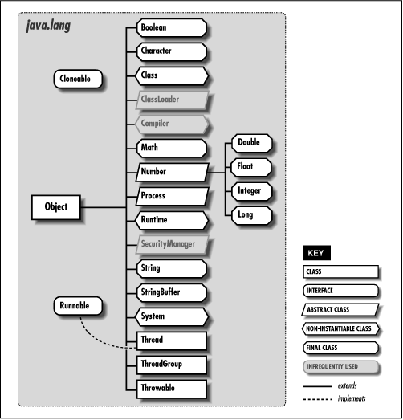

java.lang 패키지/오토박싱
=======================
자바는 기본적으로 다양한 패키지를 지원한다.  
그중에서도 <code>java.lang</code> 패키지는 JAVA 프로그래밍에서 가장 기본적이고
가장 중요한 패키지이다.

> 😸 : java.lang 패키지는 중요하기 때문에 따로 내부의 클래스를
공부하겠지만 우선은 대표적인 클래스들의 개요를 정리해보았다.

## java.lang

### wrapper class
기본형 데이터 타입의 객체화를 가능하게 도와주는 클래스들을 
<code>wrapper class</code> 라고 부른다.
* Boolean
* Byte
* Short
* Integer
* Long
* Float
* Double
### Object
모든 클래스의 최상위 클래스인 Object
### String, StringBuffer, StringBuilder
문자열과 관련된 클래스
### System
표준 입출력 시 사용된 클래스
### Math
수학과 관련된 클래스
### Thread
쓰레드와 관련된 클래스

이외에도 다양한 클래스와 인터페이스가 java.lang 패키지에 속해있다.

## 오토박싱
<pre>
public class WrapperExam {
    public static void main(String args[]) {
        int i = 5;
        Integer i2 = new Integer(5);
        Intger i3 = 5; //오토박싱
        
        int i4 = i2.intValue();
        int i5 = i2; //오토언박싱
    }
}</pre>
### 오토박싱(auto boxing)
기본 타입 데이터를 객체 타입 데이터로 자동 형변환 시켜주는 기능

<pre>Integer i3 = 5</pre>
숫자 5는 원래 기본형이지만 자동으로 Integer 형태로 변환된다.
### 오토언박싱(auto unboxing)
오토박싱과 반대로 객체 타입의 데이터를 기본형 타입 데이터로 자동 형변환

<pre>int i5 = i2;</pre>
Integer 객체타입의 값을 기본형 int로 자동으로 변환하여 할당한다.