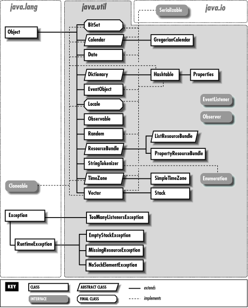

java.util 패키지
==============
java.util 패키지는 JAVA 프로그래밍에 유용한 클래스를 모아둔 패키지이다.

## java.util

## 컬렉션 프레임워크
자료구조 클래스를 컬렉션 프레임워크라고 한다.
### Collection 인터페이스
Collection 인터페이스는 여기에 자료가 있다는 것을 표현함.  
특징 : 중복 허용, 자료 저장 순서 기억 못함  
대표적인 메소드 
* add()
* size()
* iterator()

### Iterator 인터페이스
저장된 자료를 하나씩 꺼낼 수 있는 인터페이스.  
메소드
* hasNext() : 꺼낼 것이 있는지 없는 지 살펴보는 메소드
* next() : 하나씩 자료를 꺼낼 때 사용하는 메소드

### Set 자료구조
중복을 허용하지 않는 자료구조를 표현한 인터페이스  
Collection 인터페이스를 상속받는다.  
메소드
* add() : 같은 자료가 있으면 false, 없으면 true 반환

### List 자료구조
중복을 허용하고 순서를 기억하는 자료구조  
Collection 인터페이스를 상속받는다.  
메소드
* get(int n) : n 번째의 자료를 꺼냄(순서 기억)

### Map 자료구조  
Key와 Value를 가지는 자료구조이다.  
Map 에 저장된 모든 Key는 중복되면 안된다.
* put(key, value) : 저장할 때 key 와 value 를 함께 저장한다.
* get(key) : 원하는 value 값을 key 값으로 얻을 수 있다.
* keySet() : 자신이 가지고 있는 모든 key 정보를 읽을 수 있는 Set 반환
