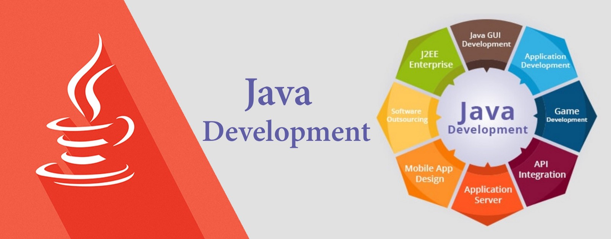

자바란?
======

> 😸 : 첫 번째 정리인데, 문법을 배우기 전에 먼저 자바가 무엇인지 알고 가면 
좋을 것 같아서 위키백과를 참고하여 정리해보았습니다.

## 개요
자바(Java)는 썬 마이크로시스템즈(회사)의 제임스 고슬링(James Gosling)과
다른 연구원들이 개발한 객체지향적 프로그래밍 언어이다.  

## 사용

자바는 처음에 가전제품 내에 탑재를 목적으로 개발되었지만 현재는 웹, 앱  
어플리케이션에 많이 사용되고 있다.  
> 😸 : 참고로 저는 자바로 웹 서버를 구축하기 위해 배우게 되었습니다.

## JVM

자바의 가장 큰 특징은 컴파일된 코드가 플랫폼(운영체제)에 독립적이라는 것.  
이것이 가능한 이유 : 자바 컴파일러가 자바 소스코드를 바이트코드로 변환한다.
이 바이트코드를 실행하기 위한 JVM(Java Virtual Machine,자바 가상 머신)이 
자바 바이트코드를 어느 플랫폼에서나 동일하게 실행한다. 이 때문에 자바어플리케이션은
CPU나 운영체제의 종류에 상관없이 JVM이 설치되는 시스템 어디서나 실행할 수 있다.

## 철학
자바는 5가지 핵심목표를 가지고 있다.  
1. 객체 지향 방법론을 사용해야 함  
2. 같은 프로그램(바이트코드)가 여러 운영체제에서 실행할 수 있어야함  
3. 네트워크 기능 탑재  
4. 원격 코드 안전 실행  
5. 다른 객체 지향 언어의 장점만 가져옴.  

JVM에 의해 한번더 해석된 후 실행되기 때문에 C/C++보다 실행 속도가 느리다.  

## 작성과 실행
> 😸 : 요즘은 IDE에서 컴파일-실행 과정은 클릭 한번으로 가능하다. 하지만 
내부적으로는 아래의 과정을 거치기 때문에 알아두면 좋을 것 같다.
1. 소스 코드 작성
    <pre>소스 파일명은 public class의 이름과 동일해야 하며, 
    파일확장자는 .java이어야 한다.</pre>
2. 컴파일 : 자바 컴파일러 사용
    <pre>javac Hello.java</pre>
    컴파일 후 바이트코드로 이뤄진 소스 코드명.class 라는 파일이 생성된다.
3. 실행 : JVM 사용
    <pre>java Hello</pre>
    실행시에는 확장자(.class)를 붙이지 않는다.